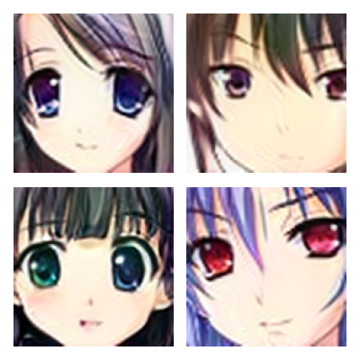

# High Resolution Image Generator in Pytorch GAN

### The model trained on anime characters image dataset (37449 images with dimensions of 128x128x3)
### Generator and Discriminator model structures used custom Scaled layers

### High resolution image generation model can generate images with resolution of 4x4 images upto 1024x1024 

#### The training stopped after 161 training epochs as dis losses reached highest loss value and gen loss started to increase as shown in tensorboard view

